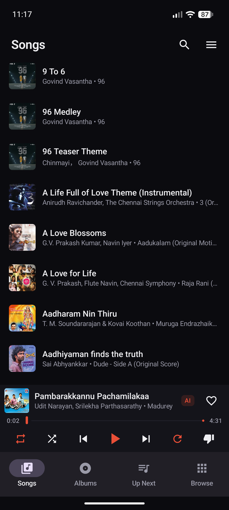
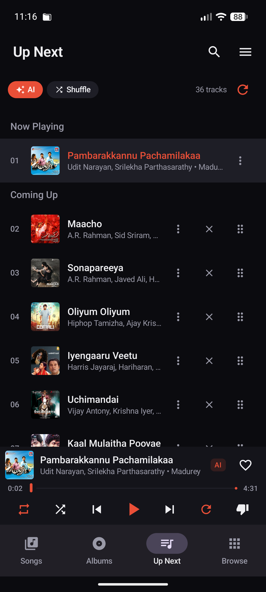
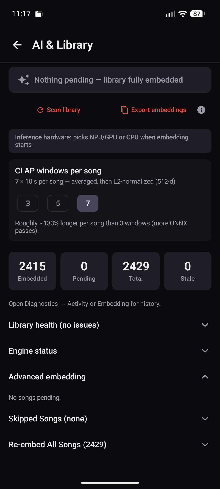
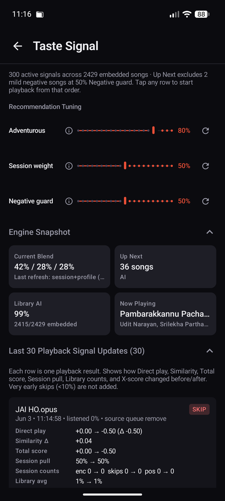
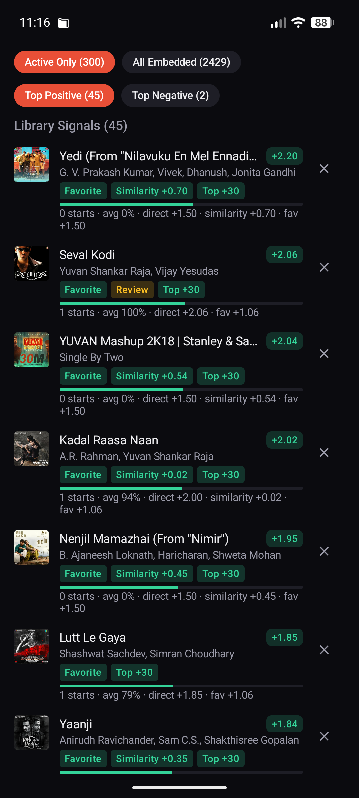
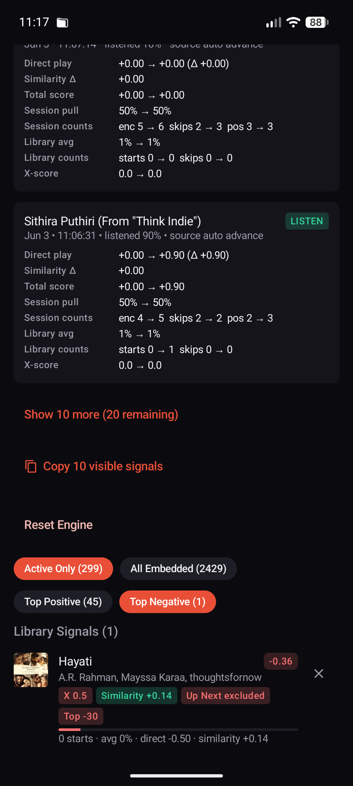
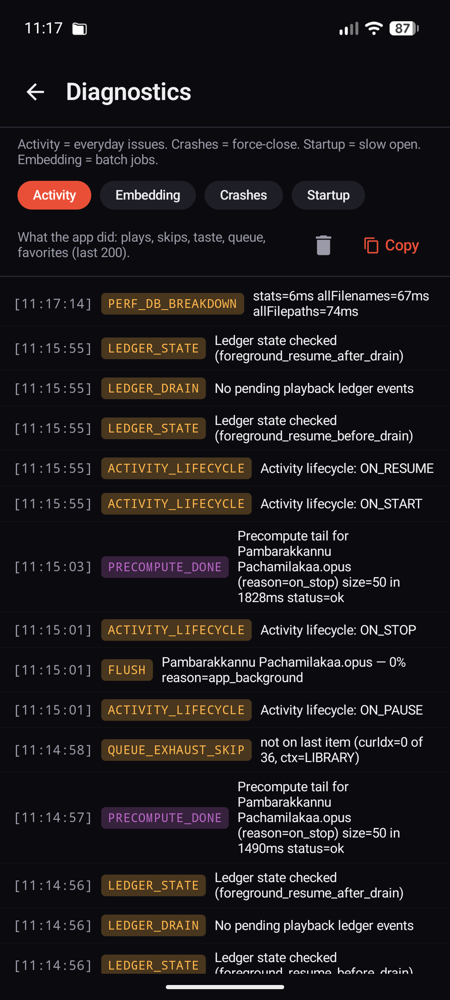

# IsaiVazhi

IsaiVazhi is an offline-first Android music player that learns from local
listening behavior. It combines native playback, durable background signal
capture, and CLAP audio embeddings to recommend music without accounts,
streaming, tracking, or a server.

<p align="center">
<a href="screenshots/isaivazhi_home.png"></a>
<a href="screenshots/isaivazhi_up_next.png"></a>
<a href="screenshots/isaivazhi_ai_library.png"></a>
<a href="screenshots/isaivazhi_taste_signal_1.png"></a>
</p>
<p align="center">
<a href="screenshots/isaivazhi_taste_signal_2.png"></a>
<a href="screenshots/isaivazhi_taste_signal_3.png"></a>
<a href="screenshots/isaivazhi_diagnostics.png"></a>
</p>

## Why It Exists

Most music apps optimize for streaming catalogs. IsaiVazhi is built for people
with personal music libraries who still want recommendation behavior that feels
adaptive. The app keeps the music, embeddings, listening history, favorites,
dislikes, playlists, and recommendation state on the device.

## Highlights

- Native Android player built with Kotlin, Jetpack Compose, Media3, and ExoPlayer.
- Offline recommendation engine that blends current song, session taste,
  long-term taste, explicit feedback, skip behavior, and CLAP similarity.
- Background-safe playback signal capture through a Media3 `MediaSessionService`.
- **Similar Songs row** in Now Playing — AI surfaces tracks similar to the
  current song; tap to play, long-press to queue.
- **AI is invisible by design** — recommendation work runs entirely in the
  background; UI never lags, stalls, or shows AI loading states.
- **Lockscreen Refresh button** — rebuilds the upcoming queue with fresh AI
  recommendations without unlocking the phone.
- **Refresh spinner** — NowPlaying and MiniPlayer show a subtle progress
  indicator only while the AI refresh is actively running.
- **Fast cold-start vector warm** — all 2455 embedding vectors are loaded into
  the JVM heap from a single SQLite Cursor pass at startup (~150ms); every
  subsequent recommendation call is heap-only, no disk I/O.
- Taste Signal page with audit-style playback evidence, tuning controls, and
  visible positive/negative signals.
- Playlist, album, Up Next, favorites, disliked songs, search, and batch delete
  flows for local libraries.
- AI management page for importing embeddings, scanning coverage, retrying
  failures, detecting duplicates, and cleaning stale rows.
- Kaggle, Colab, and local scripts for precomputing CLAP embeddings.

## Tech Stack

| Area | Choices |
| --- | --- |
| App | Kotlin, Jetpack Compose, Material 3 |
| Playback | Media3 `MediaSessionService`, ExoPlayer, Android media notification controls |
| Persistence | DataStore Preferences, SQLite, sqlite-vec |
| Recommendations | CLAP audio embeddings, vector similarity, session/taste scoring, recency decay |
| Native acceleration | C++ / NEON vector dot-product path |
| Tooling | Gradle, Android SDK 36, Python embedding scripts for Kaggle/Colab/local GPU |

## Repository Layout

```text
app/
├── src/main/
│   ├── java/com/isaivazhi/app/
│   │   ├── EmbeddingDb.java              # SQLite embedding store (sqlite-vec)
│   │   ├── EmbeddingDbManager.java       # Worker-thread DB wrapper
│   │   ├── EmbeddingService.java         # Background embedding foreground service
│   │   ├── Media3PlaybackService.java    # Media3 MediaSessionService
│   │   └── ...                           # Other Java service/contract classes
│   ├── kotlin/com/isaivazhi/app/
│   │   ├── IsaiVazhiApp.kt               # Application class — startup warm sequence
│   │   ├── MainActivity.kt               # Single activity host
│   │   ├── engine/
│   │   │   ├── EmbeddingDbFacade.kt      # Coroutine façade + JVM heap vector cache
│   │   │   ├── Recommender.kt            # Core MMR recommendation logic
│   │   │   ├── RecommendationCache.kt    # Background precompute cache
│   │   │   ├── PlaybackEngine.kt         # Playback state + queue management
│   │   │   ├── PlaybackSignalLedger.kt   # Durable cross-process signal capture
│   │   │   ├── TasteEngine.kt            # Long-term taste profile
│   │   │   ├── SessionEngine.kt          # Per-session taste
│   │   │   ├── LibraryCache.kt           # Song library JSON cache
│   │   │   └── ...                       # Favorites, history, playlists, etc.
│   │   └── ui/screens/                   # Compose screens
│   ├── cpp/
│   │   ├── embedding_native.cpp          # NEON-accelerated dot-product
│   │   └── CMakeLists.txt
│   └── AndroidManifest.xml
├── build.gradle.kts
build.gradle.kts
settings.gradle.kts
gradle.properties
```

## Install

Download the APK from the latest GitHub release and sideload it on Android.
Because the app is not installed from the Play Store, Android will ask you to
allow installs from your browser or file manager.

## Build From Source

Requirements:

- Android Studio with Android SDK API 36+
- JDK 17 or newer. The JBR bundled with Android Studio works well.
- Android NDK for the native acceleration target

```bash
git clone https://github.com/humorouslydistracted/isaivazhi.git
cd isaivazhi/native

# Point this at your local Android SDK.
echo "sdk.dir=/path/to/Android/Sdk" > local.properties

# On-device embedding only: download CLAP ONNX assets (~272 MB weights).
# Skip this if you only import isaivazhi_embeddings.bin from PC.
./scripts/fetch_onnx_assets.sh   # or .\scripts\fetch_onnx_assets.ps1 on Windows

./gradlew :app:assembleDebug
```

### On-device ONNX model (optional for build)

Phone-side embedding needs two files in `app/src/main/assets/`:

- `clap_audio_encoder.onnx`
- `clap_audio_encoder.onnx.data` (~272 MB)

They are **not** in git (GitHub file size limit). Download from the dedicated
release tag **[onnx-model-v1](https://github.com/humorouslydistracted/isaivazhi/releases/tag/onnx-model-v1)**
or run `scripts/fetch_onnx_assets.ps1` / `scripts/fetch_onnx_assets.sh`.

Details: [app/src/main/assets/README.md](app/src/main/assets/README.md)

Debug APK:

```text
app/build/outputs/apk/debug/app-debug.apk
```

## AI Architecture

### Startup warm sequence

On cold start, `IsaiVazhiApp` runs a one-time warm on a background
`CoroutineScope`:

1. `LibraryCache.loadOrScan` — deserialises the song library JSON (~1.2s).
2. `EmbeddingDbFacade.fullWarmFromDb()` — opens a single SQLite `Cursor` over
   the `embeddings` table and decodes every `vec` blob directly into
   `float[]` in a single pass. For a 2455-row × 512-dim library this takes
   **~150ms** and populates three `ConcurrentHashMap` caches:
   - `vecHeapCache` — `hash → float[]`
   - `hashToMetaCache` — `hash → HeapMeta(filename, filepath)`
   - `filenameToHashCache` — `filename → hash`
3. `RecommendationCache.start()` is started only **after** the warm completes,
   so the first recommendation query always hits the heap and never waits on
   disk I/O or mmap page faults.

After warm, every `nearestNeighbors` call is pure in-memory arithmetic; no DB
access, no mmap, no blocking. Background precomputes consistently complete in
**150–600ms** regardless of how long the app has been backgrounded (previously
27–32s when vectors were mmap-backed and the kernel had evicted the pages).

### How recommendations surface

| Surface | Trigger | What it shows |
| --- | --- | --- |
| Now Playing — Similar Songs row | Current track changes | Top 10 tracks most similar to the current song (cosine similarity) |
| Up Next queue | Refresh button (NowPlaying, MiniPlayer, lockscreen) | 50-track blended queue from current song + session taste + long-term taste |
| Queue end | Last track of an AI or Library queue | Silently appends 50 fresh AI picks so playback never stops |
| Background (on_stop) | App backgrounded while playing | Precomputes next 50-track queue from background thread; ~180–316ms |

### Refresh button

The Refresh button appears in three places:
- **Now Playing screen** — top-right area, next to the track title
- **Mini Player** — right side of the persistent bottom bar
- **Lockscreen / notification** — alongside the Favorite button (SLOT_OVERFLOW)

Tapping Refresh replaces the upcoming queue with a fresh AI-blended selection
based on what you are currently playing and your long-term taste. Any songs you
manually queued with "Play Next" are preserved at the front.

A small circular progress indicator is visible in NowPlaying and MiniPlayer
while the refresh is running. It disappears automatically when done.

### Key classes

| Class | Layer | Responsibility |
| --- | --- | --- |
| `EmbeddingDb` | Java / SQLite | Raw DB operations; `loadAllVecsIntoHeap` bulk-loads all rows in one Cursor pass |
| `EmbeddingDbManager` | Java | Worker-thread serialisation of all DB ops via `HandlerThread` |
| `EmbeddingDbFacade` | Kotlin | Coroutine façade; owns JVM heap caches; `fullWarmFromDb` drives cold-start warm |
| `Recommender` | Kotlin | MMR-based selection blending cosine similarity, taste scores, recency decay |
| `RecommendationCache` | Kotlin | Async background cache; keeps a warm 50-track precomputed tail |
| `PlaybackSignalLedger` | Kotlin | Cross-process durable signal capture; survives media service restarts |
| `TasteEngine` / `SessionEngine` | Kotlin | Long-term and per-session taste vectors |

## Embeddings

The player works as a local music player without precomputed embeddings. The
recommendation engine becomes much more useful after importing CLAP embeddings
for the library.

Use the scripts in `tools/embeddings/`:

- Kaggle GPU workflow: `kaggle_embedding_generator.py`
- Google Colab workflow: `colab_embedding_generator.py`
- Local CUDA/CPU workflow: `local_embedding_generator.py`
- Strict merge/validation: `merge_local_embeddings.py`

Primary output is now **`isaivazhi_embeddings.bin`** (IVZ1), a compact portable
format that imports much faster than legacy JSON backups.

Quick embedding flow for users:

1. Generate embeddings on Local / Kaggle / Colab (recommended split = 7).
2. Copy `isaivazhi_embeddings.bin` to your phone.
3. Import from Settings or the AI page.

The app remains fully local and private: no cloud recommendation API, no user
accounts, and no analytics dependency for playback/recommendations.

## Privacy

IsaiVazhi is designed around local ownership:

- no account
- no analytics service
- no streaming backend
- no cloud recommendation API
- playback evidence and taste profile stay on device

Kaggle, Colab, or a local GPU machine are optional tools for precomputing
embeddings. They are not required for normal playback.

## Status

Active personal/open-source project. The repository contains the full native
Kotlin/Compose Android app.

Recent changes:
- **v2026.6.3** — **IVZ1** portable embeddings (`isaivazhi_embeddings.bin`) for fast
  import/export (~5 MB vs ~25 MB JSON). Configurable **3 / 5 / 7** CLAP window splits
  on the AI page and in `tools/embeddings/embedding_config.py` (re-embed full library
  after changing split count). Legacy `local_embeddings.json` still supported.
- **v2026.6.2** — Recommendation policy: configurable negative guard
  (`negativeStrength`), hard-block top 18% of strong negatives, soft down-rank
  for Up Next. `RecommendationPolicy` and `BlendWeightLogic` extracted for
  unit tests; taste/recommender wiring in Now Playing, Refresh, and Up Next.
- **06-01k** — Fixed zero-vector warm bug: `fullWarmFromDb` replaces the old
  chunk-based JSON path; single Cursor decode eliminates 27–32s background
  stalls. Background precomputes now consistently 150–600ms.
- **06-01j** — Fixed warm-vs-observer race: full warm completes before
  `RecommendationCache` starts observing song changes.
- **UI** — Lockscreen Refresh button, AI spinner, Similar Songs row,
  last-tab persistence.

## License

[MIT](LICENSE)
