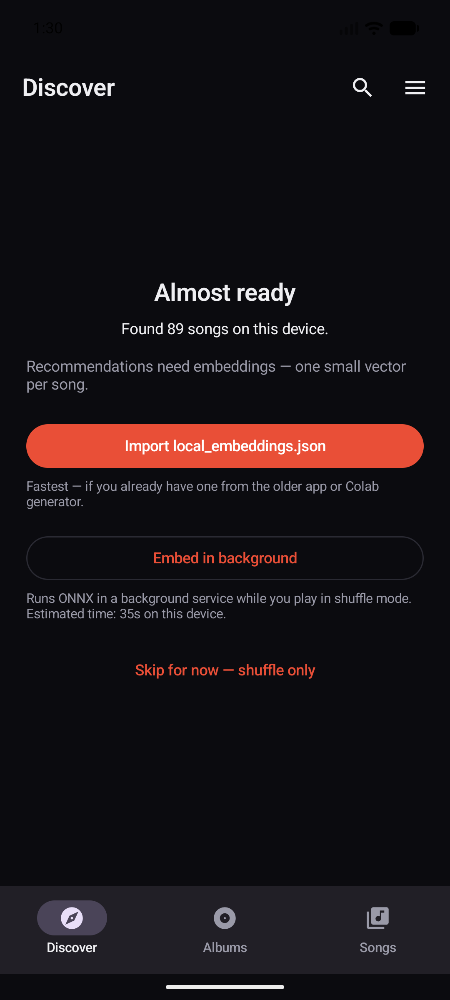
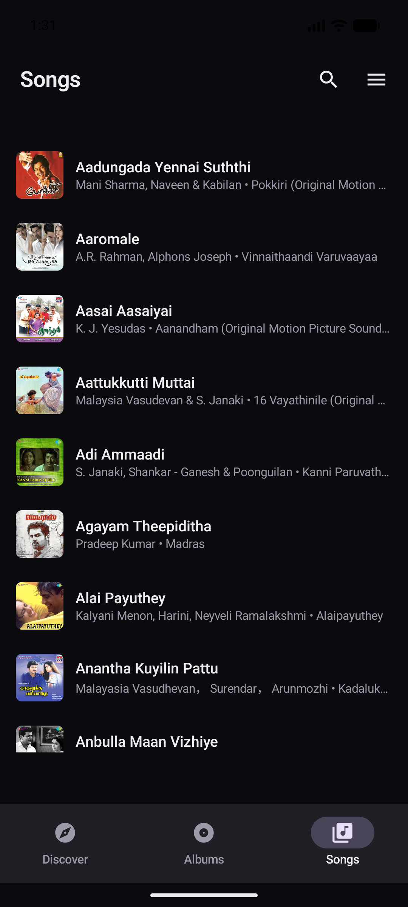
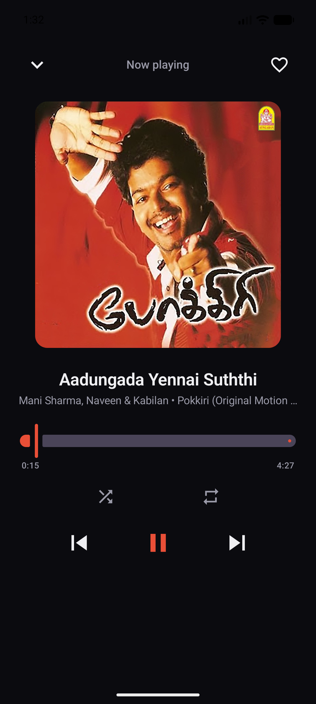
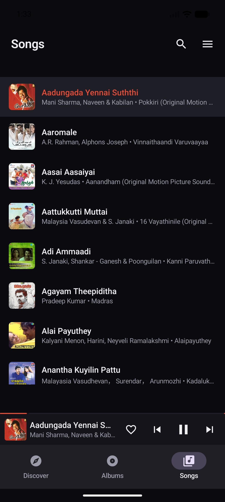

# IsaiVazhi

IsaiVazhi is an offline-first Android music player that learns from local
listening behavior. It combines native playback, durable background signal
capture, and CLAP audio embeddings to recommend music without accounts,
streaming, tracking, or a server.

Current release: `v3.1.2`

<p align="center">
  
  
  
  
</p>

## Why It Exists

Most music apps optimize for streaming catalogs. IsaiVazhi is built for people
with personal music libraries who still want recommendation behavior that feels
adaptive. The app keeps the music, embeddings, listening history, favorites,
dislikes, playlists, and recommendation state on the device.

## Highlights

- Native Android player built with Kotlin, Jetpack Compose, Media3, and ExoPlayer.
- Offline recommendation engine that blends current song, session taste,
  long-term taste, explicit feedback, skip behavior, and CLAP similarity.
- Background-safe playback signal capture through a Media3 `MediaSessionService`.
- Discover surfaces for "For You", "Because You Played", similar tracks, and
  underexplored parts of the library.
- Taste Signal page with audit-style playback evidence, tuning controls, and
  visible positive/negative signals.
- Playlist, album, Up Next, favorites, disliked songs, search, and batch delete
  flows for local libraries.
- AI management page for importing embeddings, scanning coverage, retrying
  failures, detecting duplicates, and cleaning stale rows.
- Kaggle, Colab, and local scripts for precomputing CLAP embeddings.

## Tech Stack

| Area | Choices |
| --- | --- |
| App | Kotlin, Jetpack Compose, Material 3 |
| Playback | Media3 `MediaSessionService`, ExoPlayer, Android media notification controls |
| Persistence | DataStore Preferences, SQLite, sqlite-vec |
| Recommendations | CLAP audio embeddings, vector similarity, session/taste scoring, recency decay |
| Native acceleration | C++ / NEON vector dot-product path |
| Tooling | Gradle, Android SDK 36, Python embedding scripts for Kaggle/Colab/local GPU |

## Repository Layout

```text
.
|-- native/                  # Android app source
|   |-- app/src/main/kotlin/ # Compose UI and Kotlin engines
|   |-- app/src/main/java/   # Media3 service and embedding database bridge
|   |-- app/src/main/cpp/    # Native vector acceleration
|   `-- gradle/              # Gradle wrapper
|-- tools/embeddings/        # Kaggle, Colab, local, and merge tools
|-- docs/
|   |-- architecture.md
|   `-- screenshots/
|-- LICENSE
`-- README.md
```

See [docs/architecture.md](docs/architecture.md) for a deeper overview.

## Install

Download the APK from the latest GitHub release and sideload it on Android.
Because the app is not installed from the Play Store, Android will ask you to
allow installs from your browser or file manager.

## Build From Source

Requirements:

- Android Studio with Android SDK API 36+
- JDK 17 or newer. The JBR bundled with Android Studio works well.
- Android NDK for the native acceleration target

```bash
git clone https://github.com/humorouslydistracted/isaivazhi.git
cd isaivazhi

# Point this at your local Android SDK.
echo "sdk.dir=/path/to/Android/Sdk" > native/local.properties

# Point JAVA_HOME at Android Studio's bundled JBR or any compatible JDK 17+.
export JAVA_HOME="/path/to/Android Studio/jbr"

cd native
./gradlew :app:assembleDebug
```

Debug APK:

```text
native/app/build/outputs/apk/debug/app-debug.apk
```

## Embeddings

The player works as a local music player without precomputed embeddings. The
recommendation engine becomes much more useful after importing CLAP embeddings
for the library.

Use the scripts in [tools/embeddings](tools/embeddings):

- Kaggle GPU workflow: `kaggle_embedding_generator.py`
- Google Colab workflow: `colab_embedding_generator.py`
- Local CUDA/CPU workflow: `local_embedding_generator.py`
- Strict merge/validation: `merge_local_embeddings.py`

The generated `local_embeddings.json` can be imported from the app's AI page.

## Privacy

IsaiVazhi is designed around local ownership:

- no account
- no analytics service
- no streaming backend
- no cloud recommendation API
- playback evidence and taste profile stay on device

Kaggle, Colab, or a local GPU machine are optional tools for precomputing
embeddings. They are not required for normal playback.

## Status

This is an active personal/open-source project. The current codebase is the
native Kotlin/Compose app in `native/`; older Capacitor-era development notes
were removed from the public tree to keep the repository focused on the current
implementation.

## License

[MIT](LICENSE)
