# 🦁 Makulu — Android Eatery POS

**Makulu** is a lightweight, offline-first Point of Sale app for small eateries. Built with Kotlin + Jetpack Compose, it runs entirely on-device with no internet required. Prints receipts via Bluetooth thermal printer (ESC/POS).

<p align="center">
<a href="screenshots/makulu_startup.png">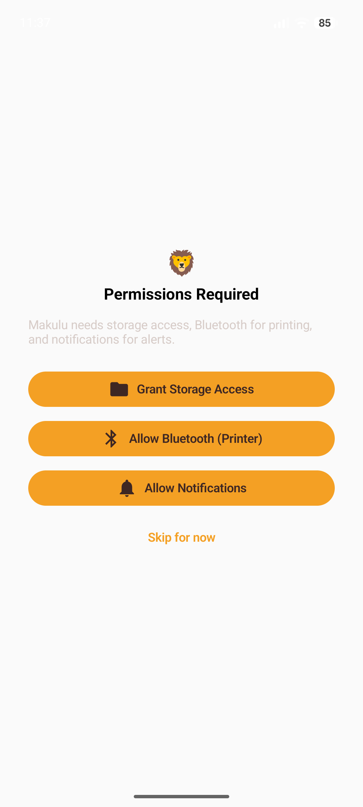</a>
<a href="screenshots/makulu_admin_setup.png">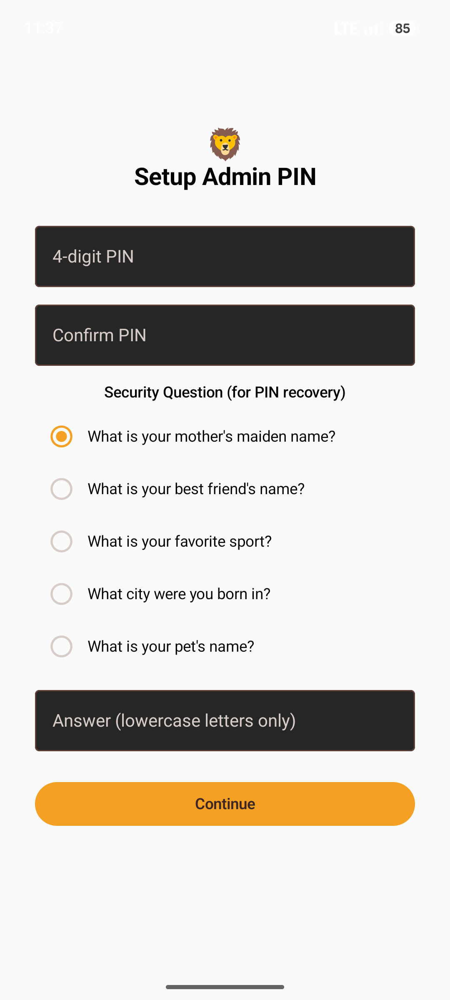</a>
<a href="screenshots/makulu_table.png">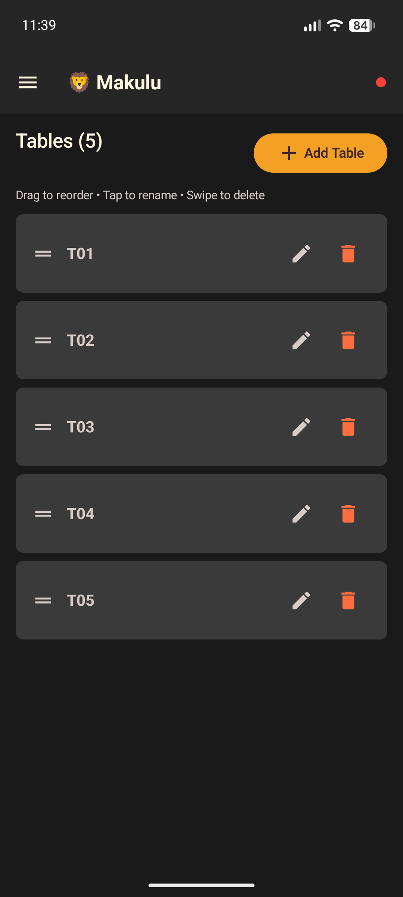</a>
<a href="screenshots/makulu_menu_items_1.jpg">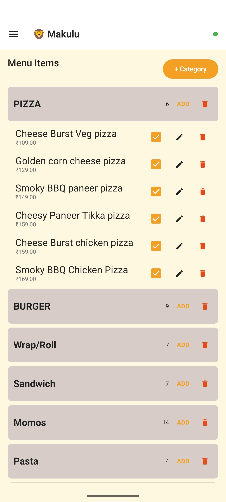</a>
<a href="screenshots/makulu_menu_items_2.jpg">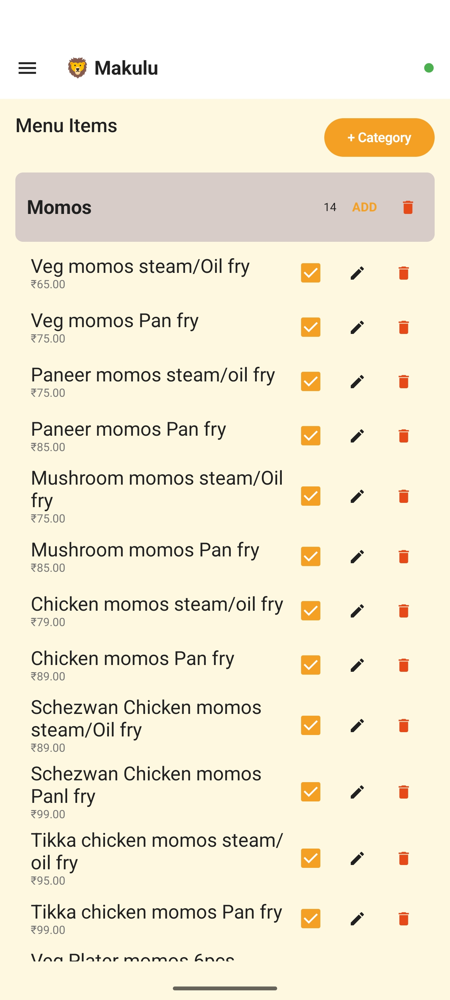</a>
</p>
<p align="center">
<a href="screenshots/makulu_inclusions.png">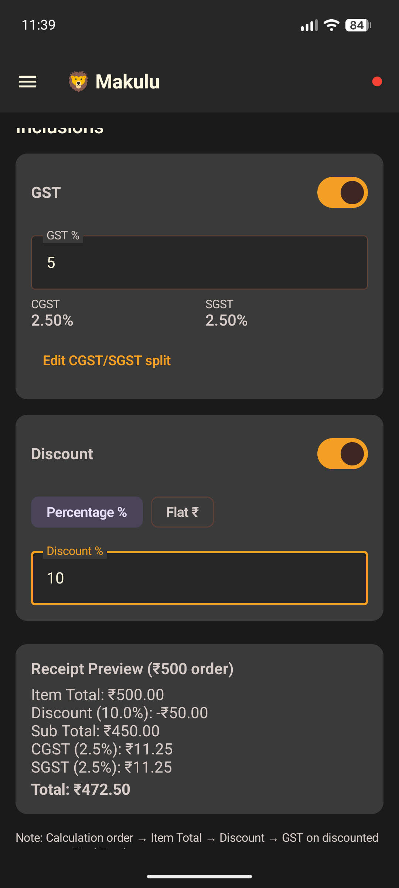</a>
<a href="screenshots/makulu_receipt_preview_1.png">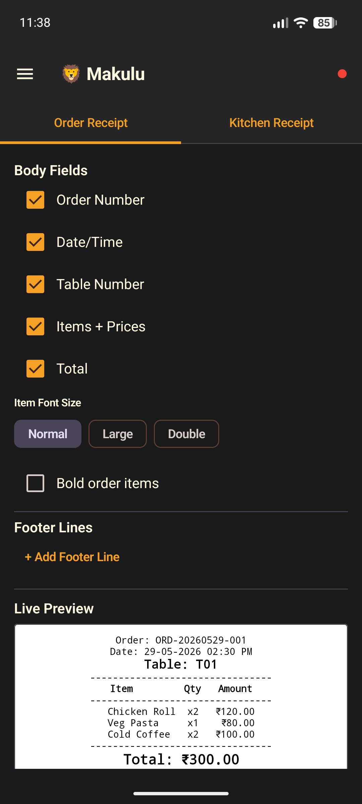</a>
<a href="screenshots/makulu_receipt_preview_2.png">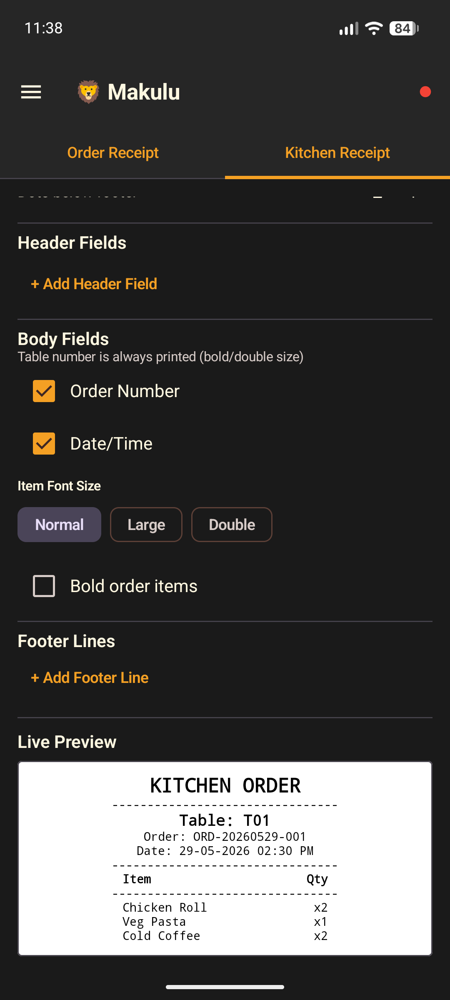</a>
<a href="screenshots/makulu_printer.png">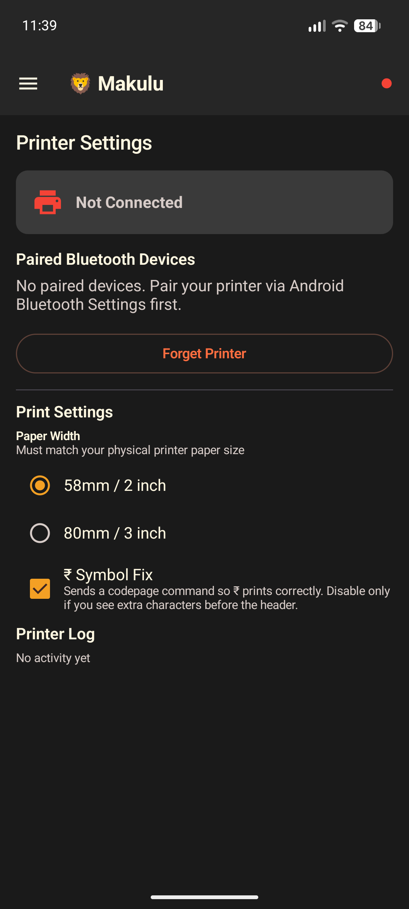</a>
<a href="screenshots/makulu_preview_order_popup.jpg">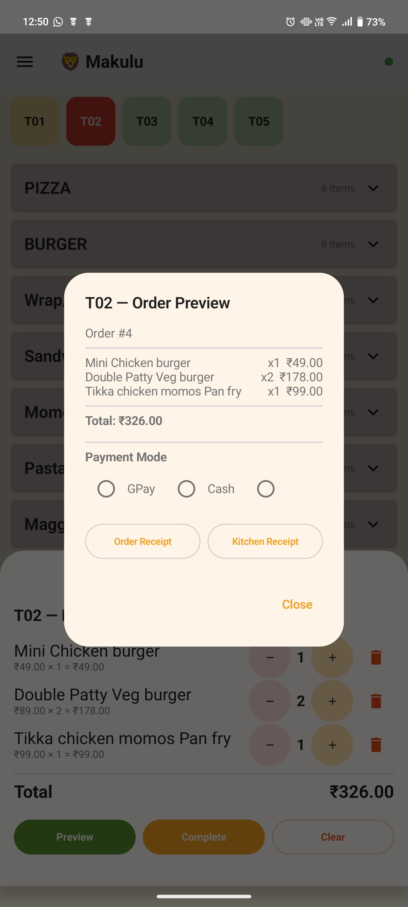</a>
</p>
<p align="center">
<a href="screenshots/makulu_todays_order.jpg"></a>
<a href="screenshots/makulu_todays_order_popup.jpg">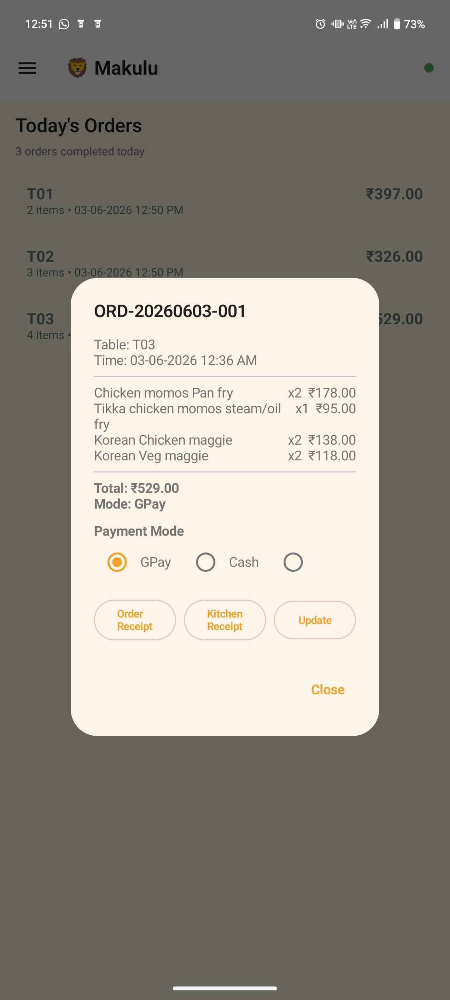</a>
<a href="screenshots/makulu_analysis.jpg">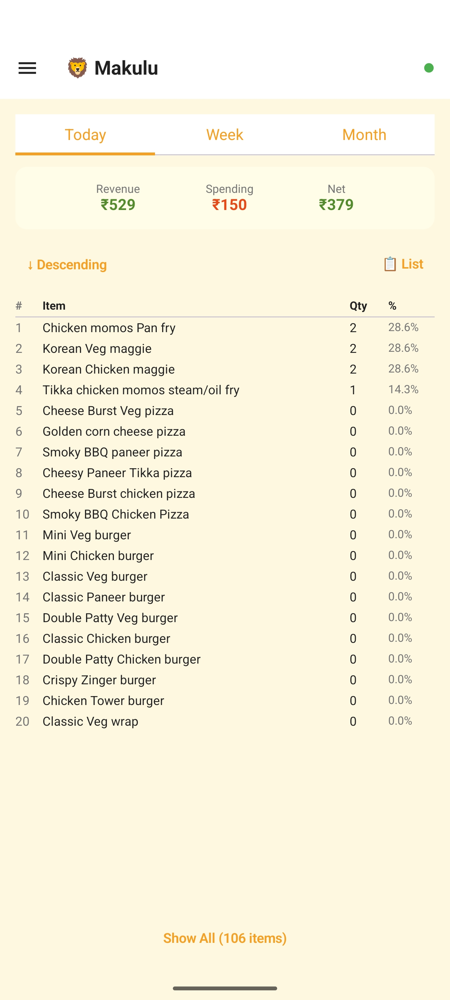</a>
<a href="screenshots/makulu_spending.png"></a>
<a href="screenshots/makulu_csv_backup.png">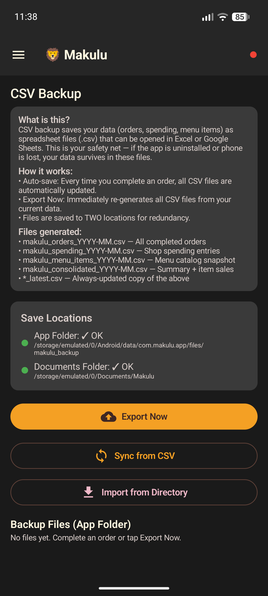</a>
</p>

---

## ✨ Features

- **Table-based ordering** — Tap a table → browse menu → add items → complete order
- **Thermal printing** — Customer receipt + Kitchen order via Bluetooth (ESC/POS)
- **Configurable receipts** — Per-field font size (Normal/Large/Double) + bold, header/footer fields, live preview, bold order items toggle
- **Kitchen receipt config** — Separate header/footer/item-size settings for kitchen slips
- **Payment mode** — GPay / Cash / custom label on every order, printed on receipt
- **Admin panel** — Manage tables, menu items, categories, receipt settings, inclusions
- **GST + Discount** — Enable/configure CGST+SGST and flat/percentage discount; frozen per-order at completion
- **Shop spending tracker** — Track daily expenses with date picker
- **Ledger & Analysis** — View order history, daily/weekly/monthly summaries with GST breakdown
- **CSV auto-backup** — Orders & spending exported to CSV on every transaction
- **Biometric/PIN lock** — App secured with fingerprint or PIN
- **Offline-first** — Room database, no server needed
- **Input sanitization** — All text fields restricted to safe characters
- **Paper width support** — 58mm (2") and 80mm (3") thermal paper, auto-scales line formatting
- **₹ Symbol Fix** — Optional codepage command for printers that garble the ₹ symbol

---

## 🏗️ Architecture

```
MVVM + Repository Pattern
├── UI Layer        → Jetpack Compose (Material 3)
├── ViewModel       → StateFlow, business logic
├── Repository      → Data operations
├── Database        → Room (SQLite)
└── Services        → PrinterManager, CsvManager
```

### Tech Stack

| Component | Technology |
|-----------|-----------|
| Language | Kotlin 2.0.0 |
| UI | Jetpack Compose + Material 3 |
| DI | Hilt 2.51.1 |
| Database | Room 2.6.1 |
| Navigation | Navigation Compose 2.7.7 |
| Auth | Biometric 1.1.0 |
| Printing | Bluetooth Classic SPP (ESC/POS) |
| Min SDK | 31 (Android 12) |
| Target SDK | 35 |

### Source Files

```
app/src/main/java/com/makulu/app/
├── Database.kt         — Entities, DAOs, Room DB, Type Converters
├── Repository.kt       — Repositories, ViewModels, Hilt Module
├── MainActivity.kt     — Activity, Auth Gate, Permission Gate, Navigation
├── OrderScreen.kt      — Table grid, menu browsing, cart, review popup
├── AdminScreen.kt      — Admin sections (tables, menu, ledger, spending, analysis, CSV, receipt)
├── PrinterManager.kt   — Bluetooth SPP, ESC/POS formatting, receipt/kitchen printing
├── CsvManager.kt       — CSV export, auto-save to internal + external storage
└── Theme.kt            — Colors, typography, Material 3 theme
```

---

## 📥 Quick Install

Download the latest APK from [Releases](https://github.com/humorouslydistracted/makulu/releases/latest) and install it directly on your Android device (SDK 31+ / Android 12+). No build needed — just install and start taking orders!

> **Note:** You may need to enable "Install from unknown sources" in your device settings.

---

## 🚀 Building from Source

### Prerequisites

- **Android Studio** Ladybug (2024.1+) or newer
- **JDK 17**
- **Android device** with SDK 31+ (Bluetooth for printing)
- No emulator support for Bluetooth printing

### Clone & Build

```bash
git clone https://github.com/humorouslydistracted/makulu.git
cd makulu
```

Open in Android Studio → Sync Gradle → Build.

Or build from terminal:

```bash
./gradlew assembleDebug
```

APK output: `app/build/outputs/apk/debug/app-debug.apk`

### Install on Device

```bash
adb install app/build/outputs/apk/debug/app-debug.apk
```

---

## 🖨️ Printer Setup

Makulu supports **Bluetooth thermal printers** using ESC/POS protocol over Bluetooth Classic SPP.

### Supported Paper Sizes
- **58mm / 2 inch** — small handheld/portable POS printers
- **80mm / 3 inch** — standard restaurant/retail printers (e.g. PosBox 3")

Set your paper size in **Printer page → Print Settings → Paper Width**.

### Tested Printers
- PosBox 3" (recommended)
- Any ESC/POS compatible 58mm or 80mm Bluetooth printer

### Pairing
1. Pair the printer with your Android device via Bluetooth Settings
2. Open Makulu → Sidebar → Printer
3. Select your printer from discovered devices
4. Print a test page to verify

### ₹ Symbol Fix
If ₹ prints as a garbled character, enable **₹ Symbol Fix** in Printer → Print Settings. This sends a codepage command (ESC t 66) to switch the printer to WPC1252 encoding.

---

## 🔐 First Launch

1. **Create PIN** — 4-digit admin PIN (required)
2. **Set security question** — For PIN recovery
3. **Connect printer** — Optional, can skip
4. **Start taking orders!**

---

## 📂 CSV Backup

Makulu automatically exports data to CSV on every order completion and spending change:

```
/storage/emulated/0/Documents/MakuluBackup/
├── orders.csv
├── order_items.csv
└── spending.csv
```

Also maintains a copy in app-internal storage.

---

## 🛠️ Development Notes

### Building without Android Studio

If you're editing code on a machine without Android Studio:
1. Edit source files in any editor
2. Copy modified files to the build machine
3. Build with `./gradlew assembleDebug` or Android Studio

### Key Dependencies (gradle/libs.versions.toml)

All versions are pinned in the version catalog. Key ones:
- Compose BOM `2024.06.00`
- Room `2.6.1`
- Hilt `2.51.1`
- Kotlin `2.0.0` + KSP `2.0.0-1.0.22`

### ProGuard

Release builds have `isMinifyEnabled = true`. If adding new libraries with reflection, update `proguard-rules.pro`.

---

## 🤝 Contributing

1. Fork the repo
2. Create a feature branch: `git checkout -b feature/my-feature`
3. Commit changes: `git commit -m "Add my feature"`
4. Push: `git push origin feature/my-feature`
5. Open a Pull Request

### Code Style
- Kotlin official style guide
- Compose best practices (state hoisting, minimal recomposition)
- Keep files focused — one screen per file

---

## 📄 License

This project is licensed under the **MIT License** — see [LICENSE](LICENSE) for details.

---

## 📝 Changelog

See [CHANGELOG.md](CHANGELOG.md) for detailed version history.

---

## 🙏 Acknowledgments

- [Jetpack Compose](https://developer.android.com/jetpack/compose)
- [Room Database](https://developer.android.com/training/data-storage/room)
- [Hilt](https://dagger.dev/hilt/)
- ESC/POS protocol documentation

---

**Made with ❤️ for small eateries** · *Last updated: June 3, 2026*
